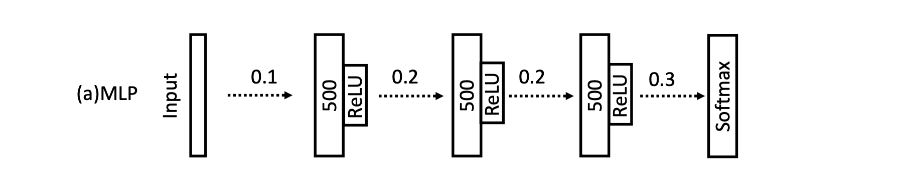

# Time-Series-Classifier-Paper-Reconstruction-

This project is a reconstruction of the Multi-Layer Perceptron (MLP) architecture used in the 2016 paper *Time Series Classification from Scratch with Deep Neural Networks: A Strong Baseline*. The paper compares the performance of this MLP with several other time-series classification methods using the UCR 2015 archive as its primary benchmark. The model itself is a fully connected neural network with three hidden layers, ReLU activations, dropout regularization, a softmax classifier, and the Adadelta optimizer.


*MLP architecture from Wang et al. (2016).*

The purpose of this project was to develop a deeper understanding of how neural networks function, from the forward pass through backpropagation. I chose to reconstruct this particular paper because it implements a relatively simple neural network framework built from components that are fundamental across modern machine learning. By implementing these operations from scratch, I hoped to better understand the mechanisms that underlie systems now used across many different fields. Although the model itself is simple compared with many of today's architectures, reconstructing it represents an important step toward developing a stronger foundation for more advanced work in machine learning.

The paper itself argues for the use of deep neural networks for time-series classification, with particular emphasis on convolutional neural networks (CNNs), such as the fully convolutional network (FCN). Its importance comes from showcasing that simple end-to-end neural networks could achieve strong performance on the time-series benchmarks of the time without requiring extensive engineering or specialized model design. In particular, the FCN and related architectures demonstrated that convolutional networks could learn useful representations directly from raw time-series data. The work helped establish deep learning as a serious approach to time-series classification and influenced much of the research that followed.

The choice to reconstruct the MLP rather than the FCN was motivated by its foundational role in neural networks and its direct connection to many concepts still used throughout modern machine learning. My reconstruction used the NumPy library to implement the operations, optimizer, and data preprocessing prescribed by the original implementation. For further details on the reconstruction methodology, see [`Results/Notes.md`](./Results/Notes.md).

## How to Run the Reconstruction

To run the program, first install the required dependencies:

```bash
```pip3 install numpy

Next, access the UCR time-series dataset archive at https://www.cs.ucr.edu/~eamonn/time_series_data/ and follow the instructions provided on the site to download the dataset.

For any dataset you choose to train or test on, make sure the corresponding files retain their original .txt filenames. You must also update the configuration at the top of the training and testing scripts to match the selected dataset, including the training and testing filenames, number of classes, and input length. These dataset-specific values can be found through the UCR archive linked above.


How to acess files

What I found about Adiac

Intepration with my data and supporting faitfhul reoncsutrion

What I learned and future amibitions

